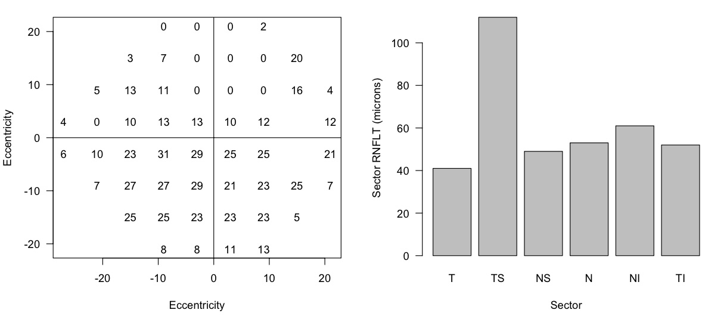

# Lions Eye Institute Structure-Function Dataset (LEI-SFD)

If you use any part of this dataset, please cite 
> Under submission to TVST, awaiting peer review (Sep 2025).


This repository contains synthetic datasets derived from clinical data on glaucomatous eyes. 
It also contains code to generate new "measured" (or noisy) data from the canonical "True" dataset provided.
The intent is that these dataset would be used to aid research into new analytical methods for detecting glaucomatous progression.

See [datasheet.md](datasheet.md) for more details.

## Usage

The data is in csv files in the [LEI_SFD1](LEI_SFD1) folder.

To generate new datasets from the ground truth `true.csv`, use  the `generate_synthetic_data(...)` function in [generate.r](generate.r). Something like (within R with the working directory set to the location of this repo)

### Simple plot
```
# In R
d <- read.csv("reliable.csv")
xys <- read.csv("xys.csv")

vf_cols <- paste0("vf.", 1:52)
oct_cols <- paste0("oct.", 1:6)

layout(matrix(1:2, 1, 2))
  # Plot first visual field for first patient
plot(xys$x, xys$y, type = "n", xlab = "Eccentricity", ylab = "Eccentricity", las = 1)
text(xys$x, xys$y, d[1, vf_cols])
abline(h = 0, v = 0)

  # Plot first OCT for first patient
sectors <- c("T", "TS", "NS", "N", "NI", "TI")
barplot(unlist(d[1, paste0("oct.", sectors)]),
    xlab = "Sector", ylab = "Sector RNFLT (microns)", names = sectors, las = 1)
```



### Generate new data
```
source("generate.r")

  # Uses current time as the random seed.
generate_synthetic_data(Sys.time(),
  noise = "unreliable_gve", 
  output_filename = "my_unreliable_gve.csv")

  # Customise the noise with 10% false positive and negative responses and no GVE
generate_synthetic_data(Sys.time(),
  noise = "custom",
  fpr = 0.1, fnr = 0.1, gve = FALSE,
  output_filename = "my_p10n10.csv")
```

## Updates

If the community finds this a useful resource, we will add more eyes in the future (claims [Andrew Turpin](mailto:andrew.turpin@lei.org.au), Jun 2025).

The current/past datasets will remain unchanged for consistent benchmarking. New data will be added in new folders with new version numbers (eg LEI_SFD2).

If you wish to contribute data to the LEI-SFD, please contact [Andrew Turpin](mailto:andrew.turpin@lei.org.au), 
or create a new subfolder (use a short name and version number, please).

## md5 Checksum

```
    cat datasheet.md `find LEI_SFD1/` | md5

    86dcb1d15bfc0ed63374256830ad2521
``
